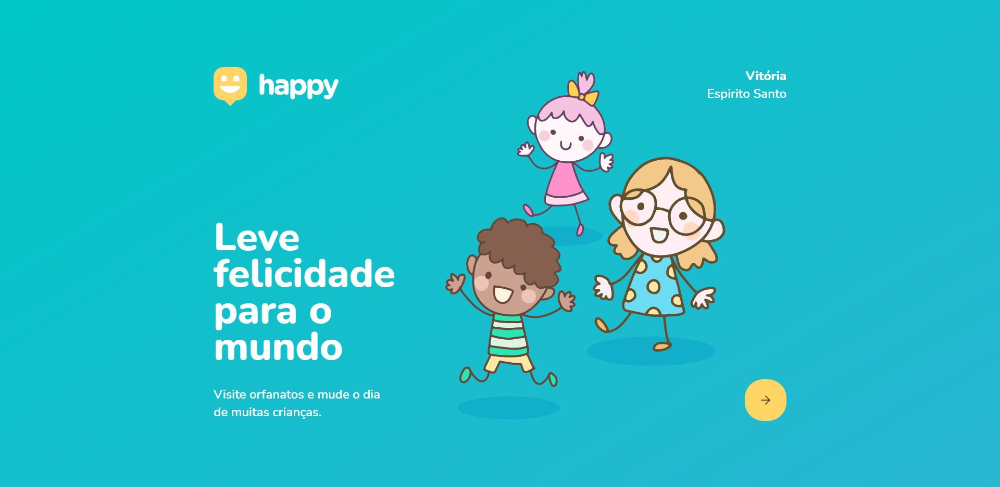

<h1 align="center">
    
</h1>

## 🚀 Tecnologias

Esse projeto foi desenvolvido com as seguintes tecnologias:

- [Node.js](https://nodejs.org/en/)
- [React](https://reactjs.org)
- [React Native](https://facebook.github.io/react-native/)
- [Expo](https://expo.io/)
- [TypeScript](https://www.typescriptlang.org/)

## 💻 Projeto

---

O Happy é uma aplicação que conecta pessoas à casas de acolhimento institucional para fazer o dia de muitas crianças mais feliz 💜

## ✈️ Executando a aplicação

---

Faça um clone da base de codigo utilizando o `git clone`

Em um terminal execute o comando
`yarn` nas pastas backend e web para instalar as dependências do projeto.

Em seguida rode o comando `yarn start` nas pastas backend e web e acesse via `localhost:3000` no seu navegador.

Feito com ♥ junto a 

[Repositorio Rocketseat](https://github.com/rocketseat-education/nlw-03-omnistack)
